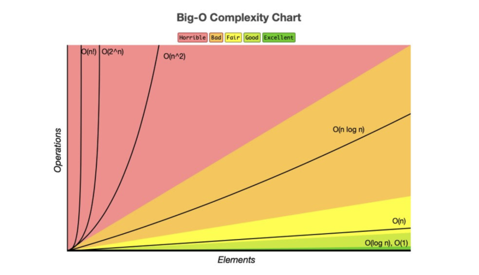

## BigO 표기법

- **빅오**: 입력값이 무한대로 향할 때 함수의 상한을 설명하는 수학적 표기 방법
- **시간 복잡도**: 어떤 알고리즘을 수행하는 데 걸리는 시간을 설명하는 계산 복잡도를 의미한다.
  - 빅오로 시간 복잡도를 표현할 때는 최고차항만을 표기하며, 상수항은 무시한다.

 

- 빅오 표기법의 종류는 크게 다음과 같다.

- $O(1)$: 입력값이 아무리 커도 실행 시간은 일정하다.
- $O(logn)$: 실행 시간은 입력값에 영향을 받지만 웬만한 n의 크기에 대해서도 매우 견고하다.
  - 로그는 매우 큰 입력값에도 크게 영향을 받지 않는 편이다.
- $O(n)$: 입력값만큼 실행 시간에 영향을 받으며, 알고리즘을 수행하는 데 걸리는 시간은 입력값에 비례한다.
  - 최댓값 또는 최솟값 경우가 이에 해당하며 이 값을 찾기 위해서는 모든 입력값을 적어도 한 번 이상은 살펴봐야 한다.
- $O(nlogn)$: 병합 정렬을 비롯한 대부분의 효율 좋은 정렬 알고리즘이다.
- $O(n^2)$: 버블 정렬같은 비효율적인 정렬 알고리즘이 이에 해당한다.
- $O(2^n)$: 피보나치 수를 재귀로 계산하는 알고리즘이 이에 해당한다.
- $O(n!)$: 각 도시를 방문하고 돌아오는 가장 짧은 경로를 찾는 Travelling Salesman Problem(TSP)를 bruth force로 풀이할 때가 이에 해당한다.
  - 가장 느린 알고리즘으로, 입력값이 조금만 커져도 다항 시간 내에는 계산이 어렵다.

 

### 상한과 최악

- **빅오(O) 표기법**은 주어진(최선/최악/평균) 경유의 수행 시간의 상한(upper bound)를 나타낸다.

 

### 병렬화

- 일부 알고리즘들은 병렬화로 실행 속도를 높일 수 있다.
- 알고리즘의 병렬화 가능 여부는 근래에 알고리즘의 우수성을 평가하는 매우 중요한 척도 중 하나이다.

 

### 자료형

- 파이썬에서 지원하는 자료형은 다음과 같다.

 

- 파이썬에서는 숫자 정수형으로 `int`만을 제공한다.
- `bool`은 논리 자료형인데 파이썬 내부에서는 내부적으로 1(True)와 0(False)으로 처리되는 `int`의 서브 클래스다.
- **매핑** 타입은 키와 자료형으로 구성된 복합 자료형이며, 파이썬에 내장된 유일한 매핑 자료형이다. 
- **set**은 중복된 값을 갖지 않는 자료형이다. 
- **시퀀스**는 어떤 특정 대상의 순서 있는 나열을 뜻한다. 
  - `str`은 문자의 순서 있는 나열로 문자열을 이루는 자료형이다. 
  - `list`는 다양한 값들을 배열 형태의 순서 있는 나열로 구성하는 자료형이다.
- 시퀀스는 불변(immutable)과 가변(mutable)으로 구분하낟.
  - `str`, `tuple`, `bytes` 타입은 한번 이 타입으로 선언되는 값은 변경할 수 없다.
    - 참조 변수만 달라질뿐, 각 할당된 str는 변하지 않고 메모리 어딘가에 남아 있다. 
  - 다만, list는 가변이다. 리스트는 자유롭게 값을 추가, 삭제할 수 있는 동적 배열이다.

 

### 원시타입

- 원시 타입은 메모리에 정확하게 타입 크기만큼의 공간을 할당하고 그 공간을 오로지 값으로 채워 넣는다.
- 만약 배열이라면 물리 메모리에 자료형의 크기만큼 공간을 갖는 요소가 연속된 순서로 배치된다. 
- 자바의 int 타입은 32bit, 객체인 Integer는 128bit나 된다.
  - 이처럼 객체는 편리하고 다양한 기능을 제공하기 위해 일정 부분 속도와 공간을 희생하게 된다.
- **파이썬**은 원시 타입을 지원하지 않는다. 
- 파이썬은 편리한 기능 제공에 우선순위를 둔 언어인만큼 느린 속도와 더 많은 메모리를 차지하더라도 훨씬 더 다양한 기능을 제공할 수 있는 객체에 관심을 둔다.

 

### 객체

- 파이썬은 모든 것이 객체다.
- 이 중 크게 불변 객체와 가변 객체로 구분할 수 있다.
- 숫자와 문자는 모두 불변 객체이다. 즉, 한번 값을 담아두면 더 이상 값을 변경할 수 없다.

 

### 속도 

- 파이썬의 객체 구조는 잘 설계되어 있고 매우 편리하고 강력한 기능을 제공한다.
- 하지만 파이썬의 객체는 값을 꺼내는 데만 해도 PyObject_HEAD에서 타입코드를 찾는 등 여러 단계의 부가 작덥이 필요하다. 

 

- **cf**
  - **자료구조(Data Structure)**: 데이터에 효율적으로 접근하고 조작하기 위한 데이터의 조직, 관리, 저장 구조를 말함.
    - 원시 자료형을 기반으로 하는 배열, 연결 리스트, 객체 등을 말한다.
  - **자료형(Date Type)**: 컴파일러 또는 인터프리터에게 개발자가 데이터를 어떻게 사용하는지를 알려주는 데이터 속성(attribute)
    - 특정 언어에서 자료형은 정수(Integer), 실수(Float), 문자열(String) 등 해당 언어에서 지원하는 원시 자료형(Primitive Data Type)까지 포함하는 모든 자료의 유형
  - **추상 자료형(Abstract Date Type, ADT)**: 해당 유형의 자료에 대한 연산들을 명기
    - 행동만을 정의할 뿐 실제 구현 방법은 명시하지 않는다.

